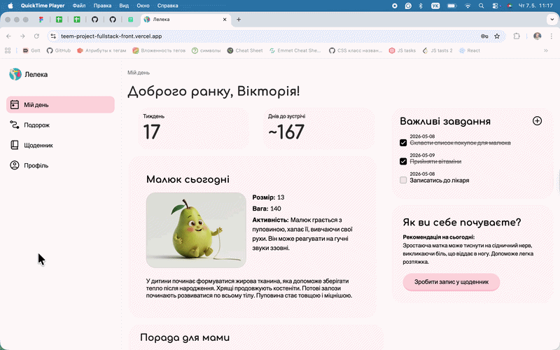

# 🕊️ Stork

A full-stack web application developed as a team project for women to track
their pregnancy journey. It provides insights into the baby’s development,
changes in the mother’s body, daily tips for mothers, as well as a task manager
and personal diary features.

## 📸 Demo



## ✨ Features

- Track pregnancy progress based on the estimated due date
- View the current week of pregnancy and countdown to delivery
- Learn about the baby's weekly development, estimated size, weight, and changes
- Fruit comparison illustrations for better visualization
- Receive helpful daily tips for mothers
- Manage tasks with an interactive to-do list
- Keep personal diary entries with timestamps
- Secure authentication system with login and registration
- Fully responsive interface for mobile, tablet, and desktop

## 🛠️ Tech Stack

**Frontend:** Next.js, TypeScript, Zustand, Axios, CSS Modules  
**Backend:** Node.js, MongoDB, Mongoose  
**Design:** Figma  
**Deployment:** Vercel  
**Tools:** Git, GitHub, ESLint, Prettier, Postman

## 🔗 Backend Repository

Backend source code: https://github.com/Wiktor-Bruy/teem-project-fullstack-back

## 🚀 Run Locally

Clone the project

```bash
git clone https://github.com/your-username/your-repo.git
```

Go to the project directory

```bash
cd your-repo
```

Install dependencies

```bash
npm install
```

Start the development server

```bash
npm run dev
```
